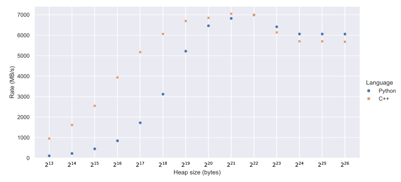
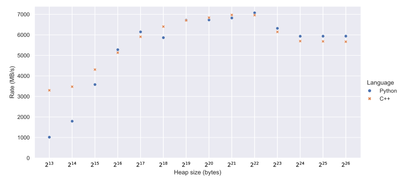

Reusing heaps
=============
In the previous sections, we saw how to improve performance for very large
heaps. Now we will turn our attention to transmitting small heaps. This is a
different challenge, where we need to reduce the per-heap overheads as much as
possible.

To start with, let's measure the transmit performance for various heap sizes.
The total amount of data sent is kept constant at 4 GiB by varying the number of
heaps to send.

It's pretty clear that Python suffers much worse with small heap sizes (not
surprising, given that Python is known to be slow) but that the C++ code is
also suboptimal below about 256 kiB per heap. While there is always going to
be some per-heap overhead, we can certainly do better. We'll focus on testing
the smallest heap size, using this command:

.. code-block:: sh

   tut_10_send_reuse_heaps -n 524288 -H 8192 -p 9000 192.168.31.2 8888

We'll start with some low-hanging fruit. The pipeline that we set up in
:doc:`tutorial 5 <tut-5-send-pipeline>` is only two heaps deep. When the heaps
are so small, this makes the pipeline very shallow when measured in bytes.
Let's increase it to be about 1 MiB deep, while ensuring we always keep at
least two heaps.

.. tab-set-code::

 .. code-block:: python
    :dedent: 0

        config = spead2.send.StreamConfig(rate=0.0, max_heaps=max(2, 1024 * 1024 // args.heap_size))
        ...
        states = [State(adc_samples=np.ones(heap_size, np.int8)) for _ in range(config.max_heaps)]

 .. code-block:: c++
    :dedent: 0

        config.set_max_heaps(std::max(std::int64_t(2), 1024 * 1024 / heap_size));
        ...
        std::vector<state> states(config.get_max_heaps());

This makes substantial improvements: 3300 MB/s for C++ and 210 MB/s for
Python.

Each loop iteration repeats all the work of setting up a heap object, even
though they all have essentially the same structure. What if this could be
done once up front? This is indeed possible, but there are some complications:

1. Each heap needs to be untouched while it is being transmitted, so we can't
   just have a single heap object and mutate it as we wish. We can, however,
   create one per state (the C++ code already does this).

2. The first heap is special, because it has the descriptors. We can just
   create an extra object for this first heap.

3. We are already updating the ADC samples in place, but we also need a way to
   update the timestamp in an existing heap. Instead of passing the timestamp
   by value, we'll need to store it in memory that we can update. This is
   somewhat complicated because the timestamp is a 40-bit big-endian value.

Let's start by extending the :py:class:`!State` class to hold the heap (for
Python) and the timestamp.

.. tab-set-code::

 .. code-block:: python

    @dataclass
    class State:
        adc_samples: np.ndarray
        timestamp: np.ndarray
        heap: spead2.send.Heap
        future: asyncio.Future[int] = field(default_factory=asyncio.Future)
        ...

 .. code-block:: c++

    struct state
    {
        std::future<spead2::item_pointer_t> future;
        std::vector<std::int8_t> adc_samples;
        std::uint64_t timestamp;  // big endian
        spead2::send::heap heap;
        ...
    };

Next, we move the code for creating each heap out of the main loop and into
the loop for initialising ``states``.

.. tab-set-code::

 .. code-block:: python
    :dedent: 0

        states = []
        for i in range(config.max_heaps):
            adc_samples = np.ones(heap_size, np.int8)
            timestamp = np.array(0, ">u8")
            item_group["timestamp"].value = timestamp
            item_group["adc_samples"].value = adc_samples
            heap = item_group.get_heap(descriptors="none", data="all")
            states.append(State(adc_samples=adc_samples, timestamp=timestamp, heap=heap))

 .. code-block:: c++
    :dedent: 0

    #include <cstddef>
    ...

        std::vector<state> states(config.get_max_heaps());
        for (std::size_t i = 0; i < states.size(); i++)
        {
            auto &state = states[i];
            auto &heap = state.heap;
            auto &adc_samples = state.adc_samples;
            auto &timestamp = state.timestamp;
            adc_samples.resize(heap_size);
            heap.add_item(timestamp_desc.id, (char *) &timestamp + 3, 5, true);
            heap.add_item(
                adc_samples_desc.id,
                adc_samples.data(),
                adc_samples.size() * sizeof(adc_samples[0]),
                true
            );
        }

In the Python version, we're using a new feature of
:py:meth:`.ItemGroup.get_heap`. Normally it does its own tracking
regarding which items and descriptors to include in the heap, but that
assumes the simple case where each time you transmit a heap you obtain it
from :py:meth:`~.ItemGroup.get_heap`. Since we're recycling heaps, we need
more direct control. We're requesting that each heap has no descriptors but all
of the actual items.

There is also some magic for adding the timestamp. In Python, we create a
zero-dimensional array [#zdarr]_ with type ``>u8``, which means 64-bit big-endian
unsigned integer. The Python bindings handle that as a special case for
immediate items [#imm]_, ensuring that the heap references the original
value rather than a copy. The C++ interface doesn't have this magic, so we
need to compute a pointer and length for the 40-bit portion we want out of the
64-bit value.

We need some similar code to set up the initial heap (immediately after the
code above):

.. tab-set-code::

 .. code-block:: python
    :dedent: 0

        item_group["timestamp"].value = states[0].timestamp
        item_group["adc_samples"].value = states[0].adc_samples
        first_heap = item_group.get_heap(descriptors="all", data="all")

 .. code-block:: c++
    :dedent: 0

        spead2::send::heap first_heap;
        first_heap.add_descriptor(timestamp_desc);
        first_heap.add_descriptor(adc_samples_desc);
        first_heap.add_item(timestamp_desc.id, (char *) &states[0].timestamp + 3, 5, true);
        first_heap.add_item(
            adc_samples_desc.id,
            states[0].adc_samples.data(),
            states[0].adc_samples.size() * sizeof(states[0].adc_samples[0]),
            true
        );

Finally, we need to update the main loop to use these heaps, and to update the
timestamp in place.

.. tab-set-code::

 .. code-block:: python
    :dedent: 0

        for i in range(n_heaps):
            state = states[i % len(states)]
            await state.future  # Wait for any previous use of this state to complete
            state.adc_samples.fill(np.int_(i))
            state.timestamp[()] = i * heap_size
            heap = first_heap if i == 0 else state.heap
            state.future = stream.async_send_heap(heap)

 .. code-block:: c++
    :dedent: 0

    #include <spead2/common_endian.h>
    ...

        for (int i = 0; i < n_heaps; i++)
        {
            auto &state = states[i % states.size()];
            // Wait for any previous use of this state to complete
            state.future.wait();
            auto &heap = (i == 0) ? first_heap : state.heap;
            auto &adc_samples = state.adc_samples;
            state.timestamp = spead2::htobe(std::uint64_t(i * heap_size));
            std::fill(adc_samples.begin(), adc_samples.end(), i);
            state.future = stream.async_send_heap(heap, boost::asio::use_future);
        }

And now let's see the results again:

This is a major improvement for small heaps, but there is still room for
more optimisation, which we will address in the next section.

.. [#zdarr] A numpy zero-dimensional array is similar to a scalar, but it is
   mutable. We will need that capability later to update the value in place.

.. [#imm] Specifically, the item must be declared with empty shape and dtype,
   and a format of either :samp:`[('u', b)]` or :samp:`[('i', b)]` where
   :samp:`b` is less than 64 and a multiple of 8.

Full code
---------
.. tab-set-code::

   .. literalinclude:: ../../examples/tutorial/tut_10_send_reuse_heaps.py
      :language: python

   .. literalinclude:: ../../examples/tutorial/tut_10_send_reuse_heaps.cpp
      :language: c++
