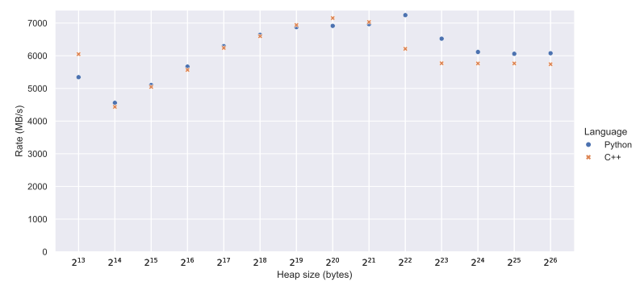
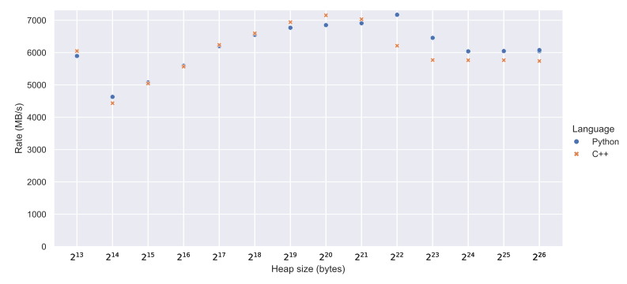

.. role:: pythoncode(code)
   :language: python

Batching heaps
==============
In the previous section we improved the performance for sending small heaps,
but it still isn't as efficient as larger heaps. In this section we'll improve
things further.

The Python version is particularly slow because there is Python code running
for every heap, and Python is slow. Interactions between Python code and
extensions is known to be particularly slow. Additionally, both the C++ and
Python versions perform inter-thread communication for every heap, and that is
similarly expensive. The solution is *batching*: instead of submitting one
heap at a time and waiting for one heap at a time, we'll process heaps in
batches.

This will require some refactoring of the code. The :py:class:`!State` class
will now represent all the state for a batch, rather than a single heap. It
will still only hold one future, but now holds a list of heaps, multiple
timestamps and multiple arrays of ADC samples. In Python we'll handle the
latter by adding an extra dimension to the arrays we're already storing; for
C++ we'll create a new structure to hold per-heap data other than the heaps
themselves (we'll see later why we do not store the heaps themselves in this
structure).

.. tab-set-code::

 .. code-block:: python

    @dataclass
    class State:
        adc_samples: np.ndarray
        timestamps: np.ndarray
        heaps: list[spead2.send.Heap]
        future: asyncio.Future[int] = field(default_factory=asyncio.Future)

        ...

 .. code-block:: c++

    struct heap_data
    {
        std::vector<std::int8_t> adc_samples;
        std::uint64_t timestamp;  // big endian
    };

    struct state
    {
        std::future<spead2::item_pointer_t> future;
        std::vector<heap_data> data;
        std::vector<spead2::send::heap> heaps;
        ...
    };

Next, we need to decide how big to make the batches, and how many batches to
keep in flight. We'll stick with our original goal of keeping roughly 1 MiB in
flight, and split it into two batches. My experiments indicate that there is
no benefit to using more than two (but we need at least two, so that we can
transmit one batch while preparing the other, just as in section 5).

.. tab-set-code::

 .. code-block:: python
    :dedent: 0

        batches = 2
        batch_heaps = max(1, 512 * 1024 // args.heap_size)
        config = spead2.send.StreamConfig(rate=0.0, max_heaps=batches * batch_heaps)

 .. code-block:: c++
    :dedent: 0

        const std::size_t batches = 2;
        const std::size_t batch_heaps = std::max(std::int64_t(2), 512 * 1024 / heap_size);
        config.set_max_heaps(batches * batch_heaps);

Preparing the ``states`` array is now slightly more involved, as it needs two
levels of indexing. We use a helper function to prepare the heap list for
either an element of ``states`` or the special heap list for the first batch
(which includes the descriptors).

.. tab-set-code::

 .. code-block:: python
    :dedent: 0

        def make_heaps(adc_samples, timestamps, first):
            heaps = []
            for j in range(batch_heaps):
                item_group["timestamp"].value = timestamps[j, ...]
                item_group["adc_samples"].value = adc_samples[j, ...]
                heap = item_group.get_heap(descriptors="none" if j or not first else "all", data="all")
                heaps.append(spead2.send.HeapReference(heap))
            return heaps

        states = []
        for _ in range(batches):
            adc_samples = np.ones((batch_heaps, heap_size), np.int8)
            timestamps = np.ones(batch_heaps, ">u8")
            states.append(
                State(
                    adc_samples=adc_samples,
                    timestamps=timestamps,
                    heaps=make_heaps(adc_samples, timestamps, False),
                )
            )
        first_heaps = make_heaps(states[0].adc_samples, states[0].timestamps, True)

 .. code-block:: c++
    :dedent: 0

        auto make_heaps = [&](const std::vector<heap_data> &data, bool first)
        {
            std::vector<spead2::send::heap> heaps(batch_heaps);
            for (std::size_t j = 0; j < batch_heaps; j++)
            {
                auto &heap = heaps[j];
                auto &adc_samples = data[j].adc_samples;
                auto &timestamp = data[j].timestamp;
                if (first && j == 0)
                {
                    heap.add_descriptor(timestamp_desc);
                    heap.add_descriptor(adc_samples_desc);
                }
                heap.add_item(timestamp_desc.id, (char *) &timestamp + 3, 5, true);
                heap.add_item(
                    adc_samples_desc.id,
                    adc_samples.data(),
                    adc_samples.size() * sizeof(adc_samples[0]),
                    true
                );
            }
            return heaps;
        };

        std::vector<state> states(batches);
        for (std::size_t i = 0; i < states.size(); i++)
        {
            auto &state = states[i];
            state.data.resize(batch_heaps);
            for (std::size_t j = 0; j < batch_heaps; j++)
            {
                state.data[j].adc_samples.resize(heap_size);
            }
            state.heaps = make_heaps(state.data, false);
        }
        auto first_heaps = make_heaps(states[0].data, true);

The Python code uses an obscure piece of numpy syntax:
:pythoncode:`timestamps[j, ...]` is a zero-dimensional array which
references the memory in :pythoncode:`timestamps`; in contrast,
:pythoncode:`timestamps[j]` is a scalar *copy* of an element.

Our main transmission loop is also more complex: it now needs to run once per
batch, while still updating the data for all the heaps in the batch. In
Python, we want to make sure that we don't involve the Python interpreter on a
per-heap basis, so we use numpy functions to compute each array in one
step. We also need to handle the case where ``n_heaps`` is not a multiple of
``batch_heaps``, in which case we need to truncate everything to the
remainder. We use ``n`` to denote the number of heaps to actually use from
this batch.

.. tab-set-code::

 .. code-block:: python
    :dedent: 0

        for i in range(0, n_heaps, batch_heaps):
            state = states[(i // batch_heaps) % len(states)]
            end = min(i + batch_heaps, n_heaps)
            n = end - i
            await state.future  # Wait for any previous use of this state to complete
            state.adc_samples[:n] = np.arange(i, end).astype(np.int8)[:, np.newaxis]
            state.timestamps[:n] = np.arange(i * heap_size, end * heap_size, heap_size)
            heaps = state.heaps if i else first_heaps
            if n < batch_heaps:
                heaps = heaps[:n]
            state.future = stream.async_send_heaps(heaps, spead2.send.GroupMode.SERIAL)

 .. code-block:: c++
    :dedent: 0

        for (int i = 0; i < n_heaps; i += batch_heaps)
        {
            auto &state = states[(i / batch_heaps) % states.size()];
            // Wait for any previous use of this state to complete
            state.future.wait();
            auto &heaps = (i == 0) ? first_heaps : state.heaps;
            std::int64_t end = std::min(n_heaps, i + int(batch_heaps));
            std::size_t n = end - i;
            for (std::size_t j = 0; j < n; j++)
            {
                std::int64_t heap_index = i + j;
                auto &data = state.data[j];
                auto &adc_samples = data.adc_samples;
                data.timestamp = spead2::htobe(std::uint64_t(heap_index * heap_size));
                std::fill(adc_samples.begin(), adc_samples.end(), heap_index);
            }
            state.future = stream.async_send_heaps(
                heaps.begin(), heaps.begin() + n, boost::asio::use_future,
                spead2::send::group_mode::SERIAL
            );
        }

Everything up to the last statement has just been refactoring, but the call to
``async_send_heaps`` is new. Instead of taking a single heap (as
``async_send_heap`` does), it takes a batch of heaps, and signals completion
only when the whole batch has been transmitted. One minor limitation this
imposes is that it can only signal failure of the batch, without being able to
indicate which (if any) of the heaps were successfully transmitted.

It also takes a parameter indicating in which order to transmit the heaps.
We're using the serial mode, in which each heap is transmitted completely
before starting on the next heap, and which matches the previous behaviour.
There is an alternative mode in which the packets comprising the heaps are
interleaved, but that is aimed at a different use case which is not discussed
here.

The results are looking much better, but the Python version still lags behind
on the smallest heap size.
There is one more trick up our sleeve: while it looks like there is only a
constant amount of interaction with the Python interpreter per batch,
``async_send_heaps`` actually needs to increment the reference count of every
heap in the list to ensure it stays alive. We can avoid this by wrapping the
list in a spead2-specific structure that holds those references for us.

.. tab-set-code::

 .. code-block:: python

    @dataclass
    class State:
        ...
        heaps: spead2.send.HeapReferenceList
        ...

    async def main():
        ...
        def make_heaps(adc_samples, timestamps, first):
            ...
            return spead2.send.HeapReferenceList(heaps)

This brings the Python version to parity with the C++ version on 8192-byte
heaps.

You might be wondering why 8192-byte heaps perform so much better than
16384-byte heaps. It is due to the ``-p 9000`` argument: the Linux kernel has a
mechanism (Generic Segmentation Offload) for efficiently handling sequences of packets
that all have the same metadata, and in particular are all the same size.
With 8192-byte heaps, each heap fits within a single packet, and the packets
are all the same size (except for the first). With 16384-byte
heaps, two packets are needed: they happen to be 9000 bytes and 7480 bytes
long (this adds up to more than 16384 because they include all the SPEAD
headers and item pointers). The lack of a long sequence of identically-sized
packets makes transmission less efficient. With much larger heap sizes this is
less of an issue because most of the packets for each heap will be the full
9000 bytes, with only the last packet containing a remainder.

With some careful calculations, it is sometimes possible to adjust the packet
size so that all the packets in the heap are the same size, and thus void this
problem. It is worth noting that the highest performance is obtained
using the :doc:`ibverbs support <../py-ibverbs>`, which is not affected by this.

Full code
---------
.. tab-set-code::

   .. literalinclude:: ../../examples/tutorial/tut_11_send_batch_heaps.py
      :language: python

   .. literalinclude:: ../../examples/tutorial/tut_11_send_batch_heaps.cpp
      :language: c++
