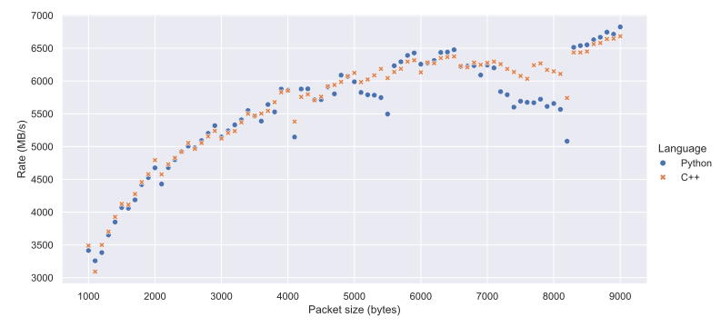

Increasing packet sizes
=======================
In this section we'll make a small but significant optimisation.
In :doc:`tut-1-spead-intro` we described heaps as the "messages" of SPEAD, but
we didn't dig much deeper into how these messages are transmitted on the wire.
Heaps can be extremely large, but lower-level protocols in the stack
(particularly Ethernet) place limits on how big frames or packets can be.
Standard Ethernet is limited to 1500-byte frames, while "jumbo" frames can be
up to 9 kiB. To accommodate these limitations, each SPEAD heap is split up
into one or more packets and reassembled on the receiver. There is overhead
associated with processing each packet, so for high performance, bigger
packets are better, provided you do not exceed the MTU (:dfn:`Maximum
Transmission Unit`) of the network path between sender and receiver.
Unfortunately, spead2 does not have any mechanism to discover the path MTU
[#pmtu]_, so you will need to find it out and then pass the value into your
program.

Our dummy interface (set up in :doc:`tut-4-send-perf`) starts off with an MTU
of 1500 (the same as standard Ethernet), so to start off, let's increase that
to a very large value so that we're not hampered by it:

.. code-block:: sh

   ip link set mtu 65536 dev dummy1

Now let's add a command-line argument to the sender to allow the packet size
to be adjusted.

.. tab-set-code::

 .. code-block:: python
    :dedent: 0

        parser.add_argument("-p", "--packet-size", type=int)
        ...
        if args.packet_size is not None:
            config.max_packet_size = args.packet_size

 .. code-block:: c++
    :dedent: 0

    #include <optional>
    ...
    static void usage(const char * name)
    {
        std::cerr << "Usage: " << name << " [-n heaps] [-p packet-size] host port\n";
    }

    int main(int argc, char * const argv[])
    {
        ...
        std::optional<int> packet_size;
        while ((opt = getopt(argc, argv, "n:p:")) != -1)
        {
            switch (opt)
            {
            ...
            case 'p':
                packet_size = std::stoi(optarg);
                break;
            ...
            }
        }
        ...
        if (packet_size)
            config.set_max_packet_size(packet_size.value());

We can now control the packet size with :option:`!-p`.

.. note::

    The packet size set in
    spead2 contains only the SPEAD-specific parts of the packet, and does not
    count the Ethernet, IP or UDP headers. For Ethernet with no VLAN information
    and IPv4 with no options, those overheads come to 42 bytes, meaning that
    you need to set the packet size at least 42 bytes less than the link-layer
    MTU.

The figure below shows how the performance scales with packet size (and also
shows how variable the results are).

.. [#pmtu] Path MTU is the maximum transmission union that can traverse the
   entire path between the sender and receiver. It may be smaller than the
   MTU of the interface on the sending server, which can be viewed with
   :command:`ip link show`.

Full code
---------
.. tab-set-code::

   .. literalinclude:: ../../examples/tutorial/tut_6_send_pktsize.py
      :language: python

   .. literalinclude:: ../../examples/tutorial/tut_6_send_pktsize.cpp
      :language: c++
